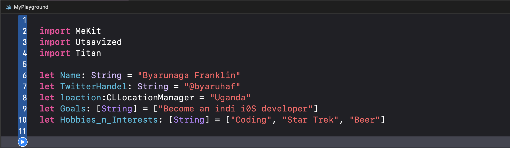

# Coding Roadmap

This [coding roadmap](https://www.engineeringwithutsav.com/coding-roadmap) is a series of projects  designed by [Utsav](https://www.engineeringwithutsav.com/about)

## About Me

## My Reasons For Doing This Roadmap
* Build a solid foundation around the fundamentals & core concepts of programming.
* Preparing for software engineering interviews.

## How Navigate This Repo 
Individual playgrouds can be opend directly via the links Listed below.

The playgrounds are also grouped in to a workspace files

* **Projects.xcworkspace**

Open the workspace files to navigate the playgound grouped for Projects's.

### Projects's

* [Module 1](./Projects/Module_1_String_Manipulation/)
* [Module 2](./Projects/Module_2_LinkedLists/)
* [Module 3](./Projects/Module_3_Hashtables/)
* [Module 4](./Projects/Module_4_Stacks/)
* [Module 5](./Projects/Module_5_Queues/)
* [Module 6](./Projects/Module_6_Recursion/)
* [Module 7](./Projects/Module_7_Binary_Search/)
* [Module 8](./Projects/Module_8_Trees/)
* [Module 9](./Projects/Module_9_Graphs/)
* [Module 10](./Projects/Module_10_Final_Project/)

##  Final Roadmap Project
Add video showing final project in action

## Study List

* [Computer Science Distilled](https://amzn.to/3vbMcqP) (Wladston Ferreira Filho)
* [Grokking Algorithms](https://amzn.to/3O4MtVa) (Aditya Bhargava)
* [Introduction To Algorithms](https://ocw.mit.edu/courses/6-006-introduction-to-algorithms-spring-2020/) (MIT)
* [Data Structures & Algorithms in Swift](https://amzn.to/3O47LlN) (Raywenderlich Tutorial Team)
* [Data Structures & Algorithms in Swift](https://www.waynewbishop.com/ios-interview/book) (Waynew Bishop)
* [LeetCode](https://leetcode.com/)
